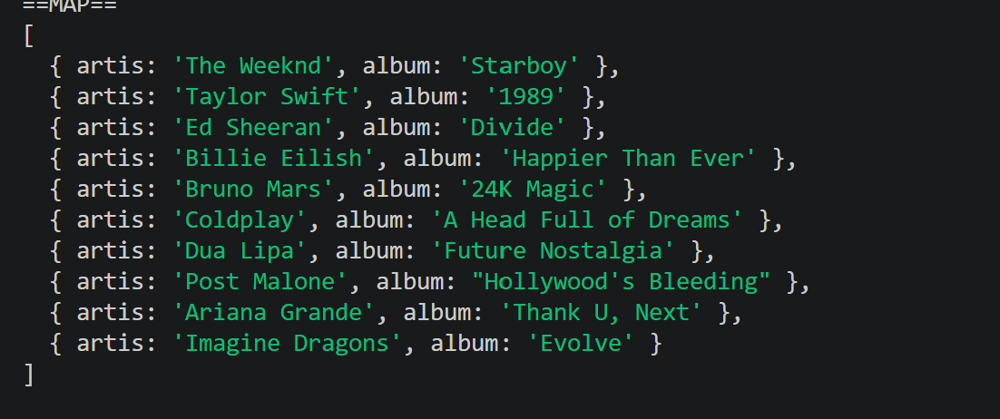
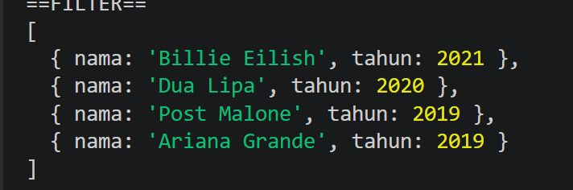
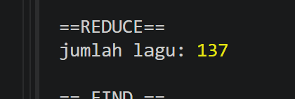
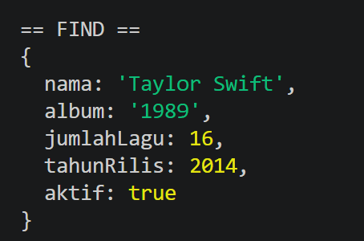
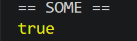
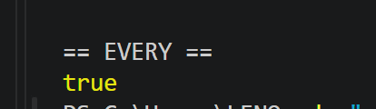

# T2-Array-Function

# Tugas 2 - Array Function

## Identitas
- Nama : Cindy Natasya Aulia Putri
- NIM  : F1D023109

## Deskripsi Tugas
Tugas ini berisi implementasi 6 metode utama array JavaScript (`map`, `filter`, `reduce`, `find`, `some`, `every`) menggunakan dataset objek daftar artis dan album musik.

## Implementasi

### map()
- Tujuan: Mengubah struktur data array untuk mengambil properti nama artis dan judul album saja.
- Screenshot: 

### filter()
- Tujuan: Filtering artis yang albumnya dirilis di atas tahun 2018.
- Screenshot: 

### reduce()
- Tujuan: Menghitung total keseluruhan jumlah lagu dari seluruh album.
- Screenshot: 

### find()
- Tujuan: Mencari data artis pertama yang memiliki jumlah lagu sebanyak 16.
- Screenshot: 

### some()
- Tujuan: Memeriksa apakah ada satu artis yang jumlah lagunya 17 atau lebih.
- Screenshot: 

### every()
- Tujuan: Mengecek apakah semua artis aktif.
- Screenshot: 

## Kesimpulan
Penggunaan keenam metode array ini sangat efisien untuk memproses, menyaring, dan mengevaluasi data secara deklaratif tanpa harus menggunakan perulangan manual.